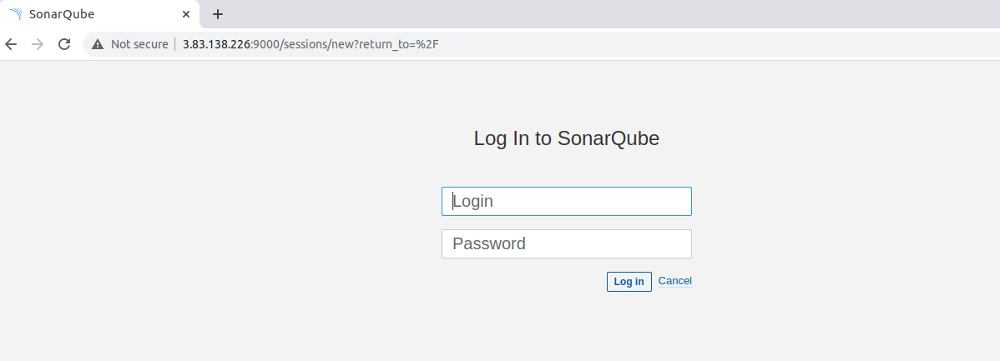

**Installing Sonarqube**
-----------------------------------------------------------

Download SonarQube using this URL:

```

wget https://binaries.sonarsource.com/Distribution/sonarqube/sonarqube-9.6.1.59531.zip


```

Unzip the downloaded file:

```

unzip -q sonarqube-9.6.1.59531.zip

```

Move the files to the /opt/sonarqube directory:

```

sudo mv sonarqube-9.6.1.59531 /opt/sonarqube

```

Create a user and group for SonarQube:

```

sudo groupadd sonarqube
sudo useradd -c "User to run SonarQube" -d /opt/sonarqube -g sonarqube sonarqube

```

Give Sonar user permissions to the /opt/sonarqube directory:

```

sudo chown sonarqube:sonarqube /opt/sonarqube -R

```

Now, to start SonarQube we have to witch to sonar user:

```

sudo su sonarqube

```

Then, we start Sonarqube:

```

cd /opt/sonarqube/bin/linux-x86-64/

./sonar.sh start

```

Finally, Sonarqube should be running on port 9000:



The default user for Sonarqube is admin and the password is admin.

-----------------------------------------------------------