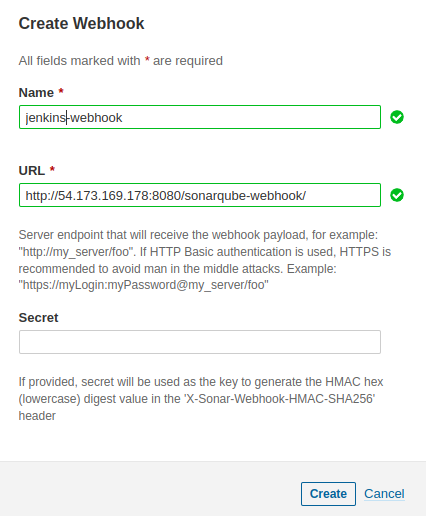

**Adding a webhook for Jenkins**
-----------------------------------------------------------

This webhook allows Sonarqube to send the Quality Gate of
projects in Jenkins.

-----------------------------------------------------------

**Go to: Administration -> Configuration -> Webhooks**

-----------------------------------------------------------
